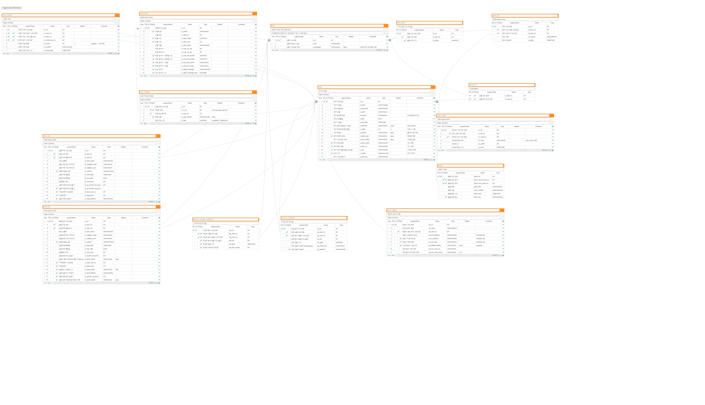
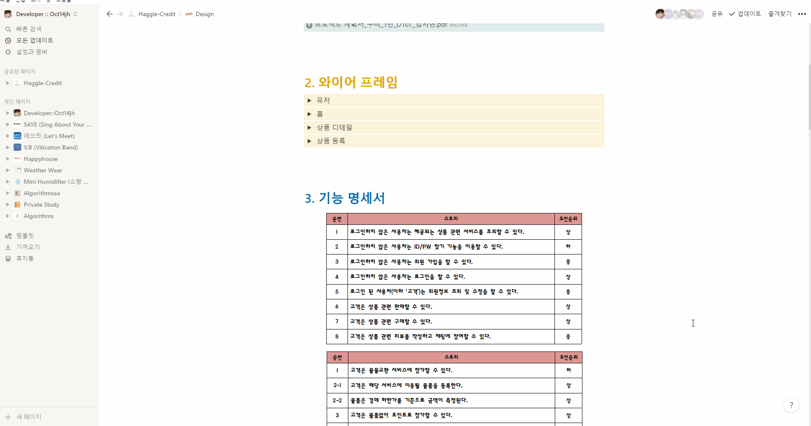
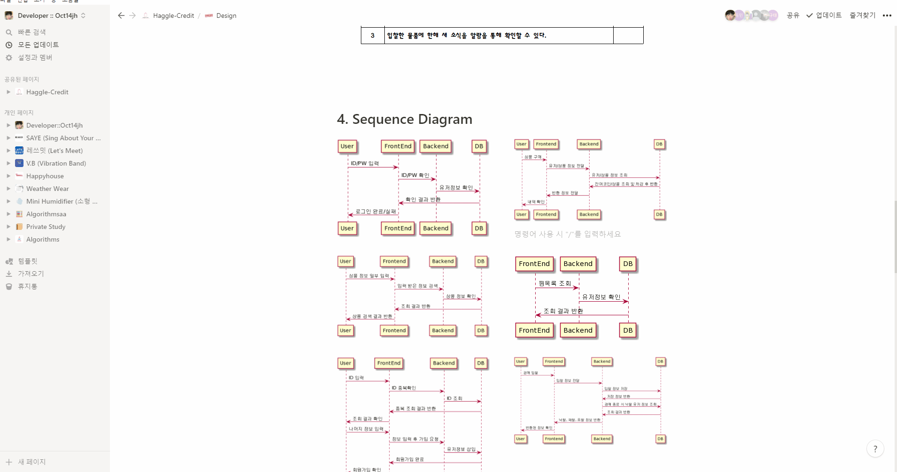
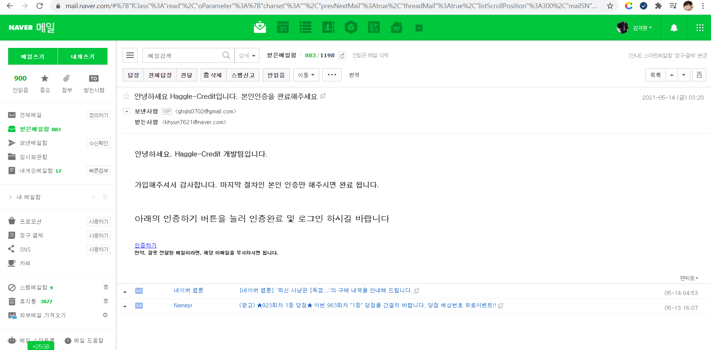
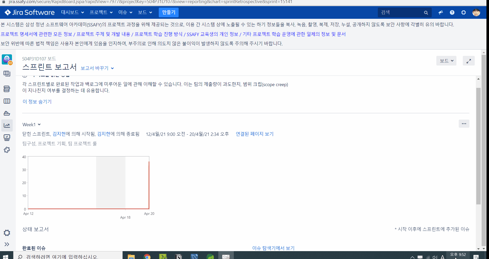

## 🌐 Haggle-Credit ?

<font size="5" color="orange">***Haggle-Credit***</font>  프로젝트는 중고 거래 및 경매 기반 이커머스 웹 서비스 프로젝트입니다. 주요 기획 의도는 <strong>개발진의 역량 향상</strong>과 <strong>이커머스 서비스 개발 경험</strong>이였습니다. 그래서 클론 코딩을 하기보다는 자체적으로 개발을 하면서 이커머스 서비스를 분석하면서 최대한 이커머스 웹 서비스 다운 서비스를 제공하고자 하였습니다.

- `Haggle-Credit` : '흥정하다'를 의미하는 'Haggle' 그리고 '신용,거래'를 의미하는 'Credit'의 합성어
- `E-gemmerce` : '이게 진정한 이커머스다'의 뜻을 담고자, E-Commerce(이커머스)를 변형한 단어
- [🛒**`Haggle Credit 바로가기`** ](https://hagglecredit.com/)


## 💡 Description


> <h3><font color="red">프로젝트 기획 배경</font></h3> 

<h5>프로젝트 기획 배경은 다음과 같습니다.</h5>
<ul>
	<li>✔️언택트 시대의 대표 서비스, 이커머스 서비스 개발 경험</li>
	<li>✔️역량 향상 :  <code><font color="blue"><b>React</b></font></code>, <code><font color="blue"><b>TypeScript</b></font></code>, 	<code><font color="lime"><b>Spring Security</b></font></code>, <code><font color="green"><b>Spring JPA</b></font></code>, <code><font color="blue"><b>Kubernetes</b></font></code></li>
	<li>✔️경매를 통한 팔리지 않는 물품 판매 처리</li>
	<li>✔️최적의 가격에 물품을 구매할 수 있는 기회 제공</li>
</ul>


> <h3><font color="blue">프로젝트 서비스 요약</font></h3>

<p>
서비스를 간단히 요약하자면, "<font color=orange>경매 기반 중고 거래 플랫폼인 이커머스 웹 서비스</font>"입니다. 이커머스 서비스의 구조를 최대한 따라가되, 리액트 등 좀 더 진보된 기술들을 활용함으로써 역량 향상 및 이커머스 서비스를 개발하고자 하였습니다. 기존에 존재하는 이커머스 서비스와 달리 경매라는 거래 방식을 도입해 구매자는 좀 더 싸게 살 수 있는 '역경매', 판매자는 자신의 물건이 어떻게든 팔리어 처리할 수 있게 되는 그리고 포인트 환전을 통한 사기방지를 추구하고자 하였습니다.</p>


>  <h3><font color="green">주요 서비스 기능</font></h3>

<h5>프로젝트의 대표 서비스는 다음과 같습니다.</h5>
<ul>
	<li>⭐️사기 방지를 위한 서비스 자체 크레딧포인트(Credit) 거래 시스템</li>
	<li>⭐️좀 더 싼 가격에 구매자가 물품을 사게하기 위한 역경매 시스템</li>
	<li>⭐️경매 시스템을 도입한 판매 활성화</li>
	<li>⭐️거래자들을 위한 팔리지 않은 물건들은 좀 더 싼 가격에 팔아주는 이벤트 경매</li>
</ul>


## 🧩 Design

> <h3><font color="red">WireFrame</font></h3>
>


> <h3><font color="blue">ERD</font></h3>
>



> <h3><font color="green">Functional Specification</font></h3>




> <h3><font color="purple">Sequence Diagram</font></h3>




## 🌎 Browser Support

|  Chrome |  Internet Explorer |  Edge |  Safari |  Firefox |
| :----------------------------------------------------------: | :----------------------------------------------------------: | :----------------------------------------------------------: | :----------------------------------------------------------: | :----------------------------------------------------------: |
|                             Yes                              |                              No                              |                             Yes                              |                             Yes                              |                             Yes                              |


## 📦 Packages (M)

1. **Front-end**

   | Name                  | Description                                                  |
   | --------------------- | ------------------------------------------------------------ |
   | axios                 | Promise based HTTP client for the browser and node.js        |
   | http-proxy-middleware | Node.js proxying made simple.                                |
   | react                 | React is a JavaScript library for building user interfaces.  |
   | react-redux           | React Redux is the official React UI bindings layer for Redux. |
   | react-router-dom      | DOM bindings for React Router.                               |
   | redux                 | Redux is a predictable state container for JavaScript apps.  |
   | redux-persist         | Persist and rehydrate a redux store.                         |
   | sockjs-client         | SockJS is a browser JavaScript library that provides a WebSocket-like object. |
   | styled-components     | `styled-components` allows you to write actual CSS code to style components |
   | typescript            | TypeScript is a language for application-scale JavaScript.   |
   | use-count-up          | React/React Native component and hook to animate<br/>counting up or down to a number |


## 📚 준비하기

1. Git clone 받기

```
git clone https://lab.ssafy.com/s04-final/s04p31d107.git
```

2. 데이터베이스 준비

- 'Haggle_Credit' 테이터베이스 생성

```
CREATE SCHEMA `Haggle_Credit`;
```

-  필요한 테이블 생성 => backend 폴더 내 sql문 파일 활용

3. [**Backend**] application.properties 설정

- backend\src\main\resources 폴더 아래 생성하시면 됩니다
- mysql 도메인과 아이디/비번 작성

```
server.port=8000
server.servlet.context-path=/haggle-credit

# for social login
spring.profiles.include=oauth

# fileupload 
spring.servlet.multipart.enabled=true
spring.servlet.multipart.max-file-size=20MB
spring.servlet.multipart.max-request-size=30MB


# db
spring.datasource.url=jdbc:mysql://k4d107.p.ssafy.io:3306/haggle_credit?serverTimezone=Asia%2FSeoul&useUniCode=yes&characterEncoding=UTF-8
spring.datasource.driver-class-name=com.mysql.cj.jdbc.Driver
spring.datasource.username=haggle_credit
spring.datasource.password=egemerce
mybatis.type-aliases-package=com.egemmerce.hc.repository.dto
mybatis.mapper-locations=mapper/*.xml
mybatis.configuration.map-underscore-to-camel-case=true
spring.jpa.hibernate.ddl-auto=update


spring.mail.host=smtp.gmail.com
spring.mail.port=587
spring.mail.username={관리자메일계정이메일}
spring.mail.password={관리자메일계정비밀번호}
spring.mail.properties.mail.smtp.auth=true
spring.mail.properties.mail.smtp.ssl.protocols=TLSv1.2
spring.mail.properties.mail.smtp.timeout=3000
spring.mail.properties.mail.smtp.starttls.enable=true
spring.mail.properties.mail.smtp.ssl.trust=smtp.gmail.com
```

4. [**Frontend**] 모듈 다운로드

```bash
# frontend 폴더로 이동
cd frontend/

yarn install
-------------------
npm install
```


## 🏁 실행하기

**Back-end**

- [Backend] (Option) Spring boot를 build(jar 파일 생성)

```
# backend 폴더로 이동해서
cd backend/
mvn -B -DskipTests -f backend
```

- 백엔드 실행
  - 생성한 jar 파일 실행

    ```
    java -jar [filename].jar
    ```

  - 혹은 war 파일 생성하지 않고 demon으로 로컬에서 실행하고 싶다면 STS와 같은 IDEA에서 Spring boot Run을 실행하거나 아래 명령어를 통해 실행

    ```
    mvn spring-boot:run
    ```

**Front-end**

```bash
# frontend 폴더로 이동
cd frontend/

yarn serve
-------------------------
npm start
```


## 🖥 배포하기

해당 서비스는 AWS EC2를 통해 배포하였고
Docker와 Jenkins를 이용해 CI/CD 구축하였습니다 :)

1. AWS EC2 인스턴스 생성 (ubuntu)
2. docker 설치
3. 필요한 이미지를 docker hub를 통해 설치
   1. Jenkins
   2. MySQL
4. Jenkins와 Gitlab repository 연동
5. MySQL 컨테이너에 `saye` DB 스키마 생성
6. Nginx 설정 (frontend/nginx 폴더의 homepage.conf)
7. frontend, backend 폴더 안에 dockerfile 작성
8. 프로젝트 root 위치에 Jenkins 파일 작성
   1. Build and Test 과정
   2. Build (frontend, backend)
   3. Run (컨테이너 실행)
9. `docker ps` 를 통해 frontend, backend, django 컨테이너가 실행되는 것을 확인 (Jenkins, MySQL 포함)


## 💻 서비스 주요 기능

1) 로그인 및 보안·인증 관리 (+결제)

- 본인 이메일 인증을 통해서만 가입 (**이메일 인증 링크** 확인 절차)



- 시큐리티를 활용한 개인 계정 **데이터 암호화** 처리


- 결제 서비스는 본인의 **휴대전화 및 카카오페이 인증** 처리


2) 판매 서비스

- 판매 상품명 내용, 카테고리, 이미지 등을 작성하면 **판매 등록**


- 판매종료일, 이벤트 경매 동의 여부 등 추가 옵션을 활용해 **경매 서비스에 활용**


3) 구매 서비스

- 구매 상품명 내용, 카테고리, 이미지 등을 작성하면 **구매 등록**


- 채팅방을 활용한 **역경매 서비스 유도**


4) 경매 서비스

- 판매의 즉시거래가가 아닌, **입찰가를 통해 자동 경매 진행**


- 판매종료일 시점이 지나면, 최종 입찰자에게 **자동 거래**


- 입찰 시, 포인트는 미리 귀속되기에 **무차별적 입찰 진행 차단** 및 빠른 자동 거래까지 진행

5) 역경매 서비스

- 구매자의 즉시 거래가 보다 더 싸게 팔아 거래가 원활히 진행되고자 기획


6) 기부 서비스

- 구매자들은 뜻밖의 이벤트 특가로 구매 기회를, 판매자는 기부를 통한 공익 실현을 위해 기획


- 판매로 등록할 때 **동의여부에 '동의'한 판매자에 한해 상품 등록**


- 판매종료일 시점까지 거래가 되지 않은 상품들은 기부 서비스 상품으로 등록

- 상품을 알려주고, **단돈 100원(=100크레딧)으로 응모 가능**


- 목표 기부 금액에 도달할 시, 응모한 사람들 내 **상품 거래 확정자(당첨자) 결정**

- **응모비로 모인 금액은 판매자의 이름으로 기부 됨**


7) 상품 관련 서비스

- 상품의 판매자에 접근하여 해당 판매자의 리뷰 확인 가능


- 상품 문의를 통한 다대다 소통


8) 유저 관련 서비스

- 프로필 등록 및 수정

  ⇒ 프로필사진, 계좌등록, **크레딧 충전**, 자기소개 등


- Haggle-Credit에서 이용한 서비스 확인

  ⇒ **상품**(판매/구매), **거래 리뷰**(쓴것/쓰인것), 찜, **입찰내역**, **거래내역**


---


## 🛠 Dev Skills

<div style="display:flex; justify-content: center;">
<p align="center">
  <a href="https://ko.reactjs.org/">
  
  </a>
  <a href="https://www.typescriptlang.org/">
  
  </a>
   <a href="https://styled-components.com/">
  
   <a href="https://redux-saga.js.org/">
  
  </a>
 </p>
 <p align="center">
  <a href="https://spring.io/">
  
  </a>
  <a href="https://spring.io/projects/spring-security">
  
  </a>
    <a href="https://spring.io/projects/spring-data-jpa">
  
  </a>
  <a href="https://www.mysql.com/">
  
  </a>
   </p>
    <p align="center">
  <a href="https://docs.aws.amazon.com/ec2/index.html?nc2=h_ql_doc_ec2">
  
  </a> 
  <a href="https://www.docker.com/get-started">
  
  </a>
   <a href="https://www.jenkins.io/">
      
  </a>
  <a href="https://kubernetes.io/ko/docs/concepts/overview/what-is-kubernetes/">
  
  </a>
   </p>
    <p align="center">
  <a href="https://www.atlassian.com/ko/software/jira/">
  
  </a>
  <a href="https://www.notion.so/9afd18e7efe54feba56f48c35a99270b">
  
  </a>
  <a href="https://www.java.com/ko/">
  
  </a>
</p>
</div>


## 👨‍👦‍👦 Team. E-gemmerce

> 중고 경매 기반 이커머스 웹 서비스 'Haggle-Credit' 프로젝트의 개발진들을 소개합니다
>


#### 김동빈

- 개발 파트 : **Backend**
- 담당 개발 : **서버배포 및 관리**, REST API 개발, 영상 감독
- 팀내 역할 : 웃음 사냥꾼
- 개발 후기 : 서버배포를 한번쯤 하고 싶다는 생각이 들었는데, 이게머스팀에서 서버 배포를 해볼 수 있어서 너무 좋았습니다. 단지, 쿠버네티스를 활용하여 도커를 관리하며 사용하려했으나 우선순위상 작업이 밀려 활용치 못했다는게 다소 아쉬웠습니다. 기회가 된다면, 리팩토링을 하면서 쿠버네티스를 활용해 이커머스 서비스를 잘 마무리하고 싶습니다.

#### 김지현

- 개발 파트 : **Backend**
- 담당 개발 : REST API 개발, **DB 설계 및 구축**, 문서 작업
- 팀내 역할 : 팀장
- 개발 후기 : C2C 프로젝트의 개발을 경험하고 싶었는데, 그중에서도 중고 경매 기반 이커머스 웹서비스를 개발할 수 있었다는 것이 너무나 좋았습니다. 팀장으로써, 좀 더 전체를 이끌었어야 했는데 그러지 못하였고 그 결과, 개발 진행 당시 어려움을 맞이한 것 같아 팀원들에게 미안하고 고마울 따름입니다. JPA와 쿠버네티스를 어깨너머로 보고 배우면서 제 커리어에도 적용할 수 있도록 개발 공부를 이어갈 것입니다.

#### 임호빈

- 개발 파트 : **Backend**
- 담당 개발 : **REST API 개발**, DB 설계 및 구축, JPA 처리
- 팀내 역할 : 큰형님
- 개발 후기 : MyBatis를 활용하여 개발만 하다가 개발 실무에서는 JPA를 많이 쓴다는 것을 듣고 JPA를 활용하여 개발하고 싶었습니다. 그리고 이번 기회에 JPA를 활용해 개발을 할 수 있어서 개인적으로 좋은 경험이였습니다. 다소 아쉬운 점이 있다면, JPQL을 활용하지 못한 것입니다.

#### 손동민

- 개발 파트 : **Frontend**
- 담당 개발 :  유저페이지관리, 판매글 / 구매글 작성페이지, 결제시스템
- 팀내 역할 : Egemmerce
- 개발 후기 : 프로젝트를 거듭 진행하며 새로운것을 많이 배우고, 공부할 수 있는 기회였어서 좋았습니다. 시간에 쫓기며 개발을 하다보니 디테일한 부분에서 조금 미흡했어서 아쉬웠습니다. 이 부분들을 리팩토링해보며 부족했던 부분들을 다시 보완할 계획입니다.

#### 이성헌

- 개발 파트 : **Frontend**
- 담당 개발 : 경매 / 역경매, 기부, 채팅, 알림
- 팀내 역할 : 부팀장
- 개발 후기 : 새로운 기술인 TypeScript를 React에 적용해보면서 실력이 한층 더 성장한 것을 느꼈고, 앞으로 꾸준히 공부해 더욱 성장할 수 있는 개발자가 되어야겠다고 생각했습니다.


## 📝 Non-Dev Contents

## 


## 💬 Documents
- <a href="https://www.hagglecredit.com" _blank="new"><strong>Haggle Credit</strong></a> 바로가기
- <a href="https://www.notion.so/oct14jh/Haggle-Credit-5504f21c3ea14758be4bc81b1c369264" _blank="new"><strong>Notion</strong></a> 바로가기
- <a href="https://drive.google.com/file/d/1fGGDVcdQsfXFqQi3PVNhsJVgMEI6tBpW/view" _blank="new"><strong>최종발표PPT</strong></a> 바로가기
- <a href="https://youtu.be/5QDVILeJgYY" _blank="new"><strong>최종영상</strong></a> 바로가기


## 📌 References

- 🛍<a href="http://shinsegaemall.ssg.com/" _blank="new">신세계몰(SSG)</a>
- 🛍<a href="https://m.bunjang.co.kr/" _blank="new">번개장터</a>
- 🛍<a href="https://www.gmarket.co.kr/" _blank="new">G-마켓</a>
- 🖥<a href="https://www.inflearn.com/" _blank="new">기타 기술 참고 사이트</a>


# 🏷License

<p>
This software is licensed under the MIT  <a href="https://www.ssafy.com/ksp/jsp/swp/swpMain.jsp" _blank="new">©SSAFY</a>.</p>
